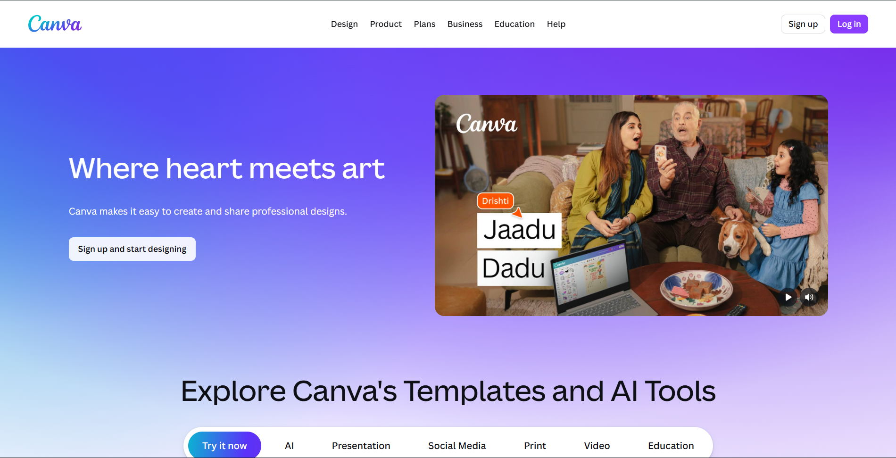

# 🎨 Canva Clone

A **responsive Canva Landing Page Clone** built using **HTML, CSS, and JavaScript**.
This project replicates the modern UI of Canva including a landing page, login page, and templates section with interactive elements such as dropdown menus, banner sliders, and mobile navigation.

---

## 🚀 Project Overview

The goal of this project was to recreate the **Canva landing experience** while practicing **frontend development fundamentals** like layout design, responsive UI, and DOM interactions.

This project includes multiple pages and interactive UI elements similar to the original Canva website.

---

## ✨ Features

* 🎨 Canva-style **Landing Page**
* 🔐 **Login Page UI**
* 🧩 **Templates Section**
* 📱 **Responsive Design (Mobile + Desktop)**
* 📂 **Dropdown Navigation Menu**
* 📱 **Mobile Navigation Menu**
* 🖼 **Banner Image Slider**
* ⚡ Fast and lightweight frontend implementation

---

## 🛠 Tech Stack

* **HTML5**
* **CSS3**
* **JavaScript (Vanilla JS)**

---

## 📂 Project Structure

```
Canva_Clone
│
├── index.html
├── login.html
├── templates.html
│
├── style.css
├── login.css
├── templates.css
├── media-query.css
│
├── script.js
│
└── Preview
    └── image.png
```

---

## 📸 Project Preview



---

## 💡 What I Learned

While building this project, I improved my understanding of:

* Responsive web design using **CSS Media Queries**
* Creating **interactive UI with JavaScript**
* Implementing **dropdown menus**
* Building **mobile navigation menus**
* Creating **image sliders**
* Structuring a **multi-page frontend project**

---

## ⚡ Installation & Setup

Clone the repository

```
git clone https://github.com/RonitkumarSoni/canva-clone.git
```

Navigate to the project folder

```
cd canva-clone
```

Open in browser

```
Open index.html
```

---

## 🚀 Future Improvements

* Add full Canva editor UI
* Add backend authentication
* Convert the project into **React**
* Add dynamic templates with database

---

## 👨‍💻 Author

**Ronit Kumar Soni**

💻 Computer Science Student
🌍 Kalol, Gujarat, India

📧 Email: [ronitkumarsoni.cg@gmail.com](mailto:ronitkumarsoni.cg@gmail.com)

🔗 GitHub:
https://github.com/RonitkumarSoni

---

⭐ If you like this project, feel free to **star the repository**!
